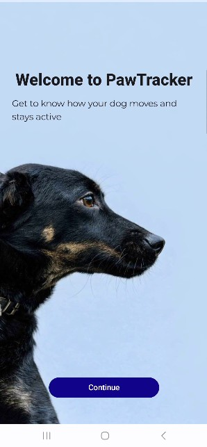
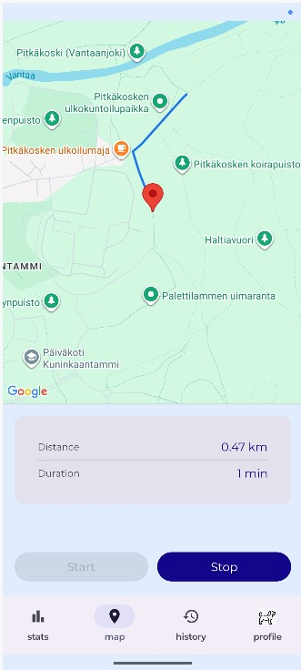
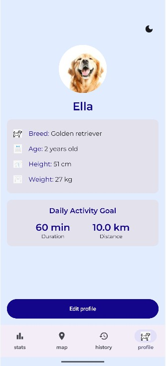
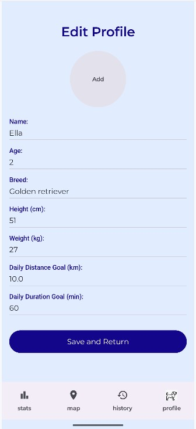
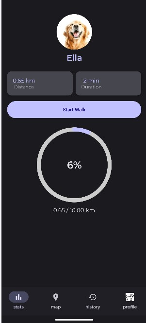
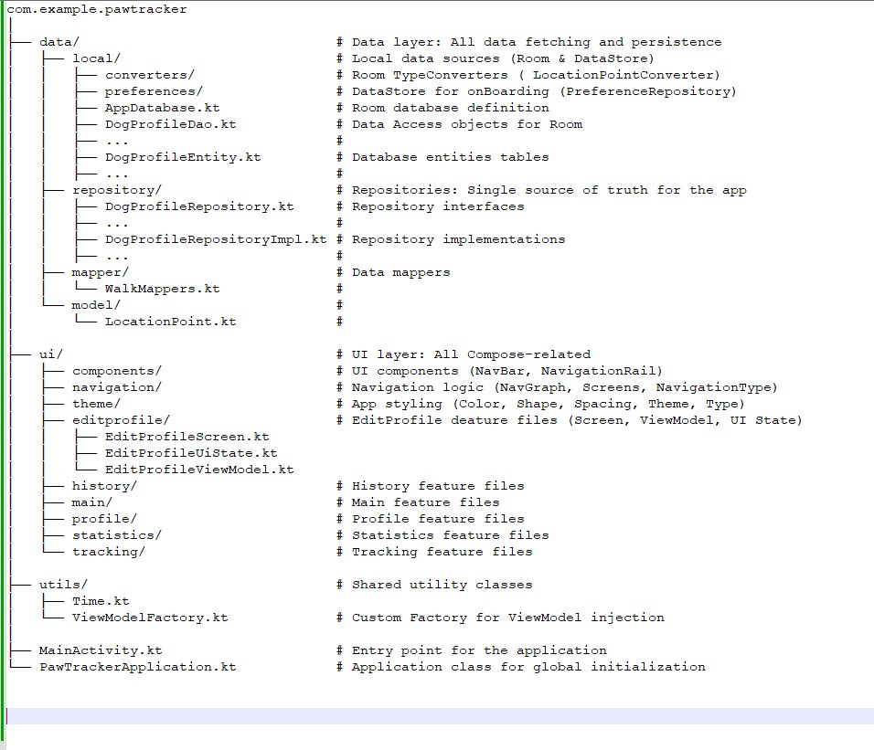

PawTracker is an Android application designed to help dog owners monitor and improve their dog’s daily physical activity.

Dog owners often don’t know whether their pets are getting enough exercise, which can negatively affect their health. PawTracker provides a simple, visual interface that displays dog’s walking routes.

Application uses the phone’s GPS to automatically record routes, calculate distance and duration, and store the data for long-term tracking.

### Screenshots

  &nbsp;
  &nbsp;
  &nbsp;
  &nbsp;
  

### Core Features

- **GPS Tracking** – Records walking routes in real time
- **Map View** – Visualizes routes using Google Maps
- **Activity Statistics** – Distance, duration and daily/weekly totals
- **History** – Stores past walks using Room database
- **Modern UI** – Clear and responsive design
- **Unit Testing** – Tests for ViewModel logic and data handling

### Architecture
MVVM (ViewModel + StateFlow)

### Technology Stack
- **Language:** Kotlin
- **UI:** Jetpack Compose with Material 3 & Navigation Component
- **DI:** Custom Factory
- **Local Database:** Room
- **Preferences:** Jetpack DataStore
- **Hardware & APIs:** Google Fused Location Provider, Google Maps SDK
- **Testing:** JUnit 4 (Unit tests), Espresso (UI tests), Room Integration tests
- **Design:** Figma, Adobe Firefly
- **Project Management:** Jira

### Testing
#### **Unit tests**
`./gradlew test`

#### **Instrumented tests & UI**
`./gradlew connectedAndroidTest`

#### **All tests:**
`./gradlew check`

#### **Code Coverage Report:**
`./gradlew jacocoTestReport`

---

## Getting Started
1. Clone the repository
2. Obtain a Google Maps API Key from [Google Cloud Console](https://console.cloud.google.com/)
3. Create a `local.properties` file in the root folder and add:
   `MAPS_API_KEY=YOUR_KEY`
4. Build the project in Android Studio
